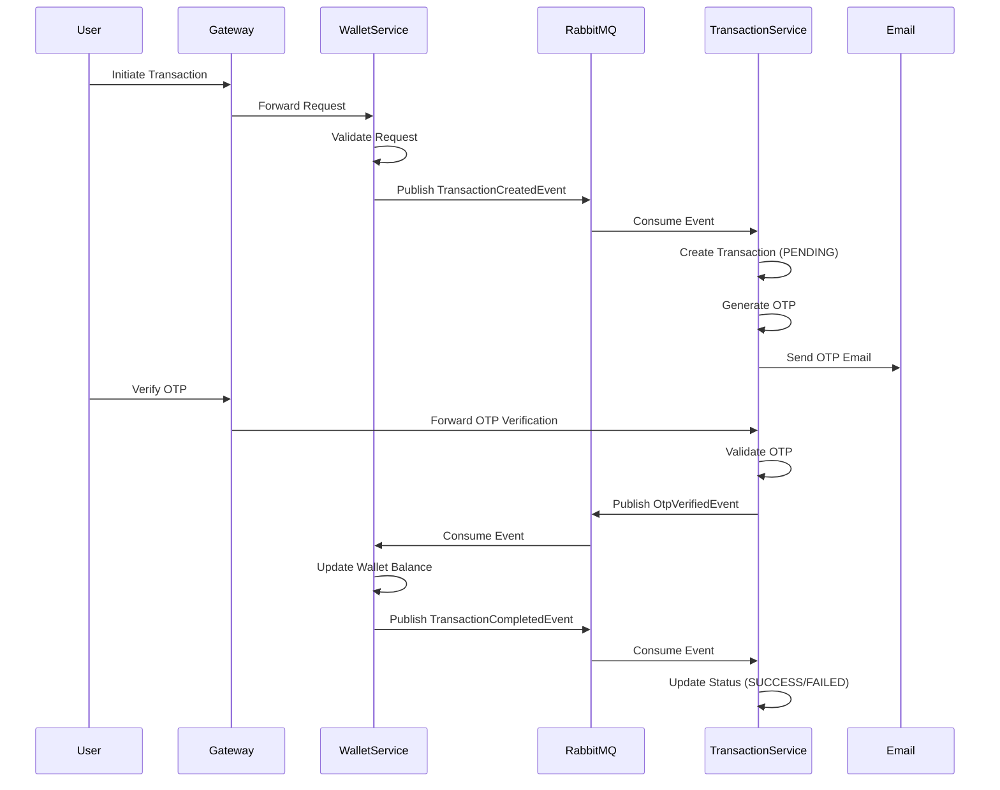

# 💳 E-Wallet Microservices Application

<div align="center">


**A distributed microservices-based e-wallet system built with Spring Boot, featuring secure transaction processing with OTP verification, event-driven architecture, and API Gateway integration.**

[Features](#-features) • [Architecture](#️-architecture) • [Quick Start](#-quick-start) • [API Documentation](#-api-documentation) • [Contributing](#-contributing)

</div>

---

## 📋 Table of Contents

- [Features](#-features)
- [Architecture](#️-architecture)
- [Technology Stack](#️-technology-stack)
- [Services](#-services)
- [Prerequisites](#-prerequisites)
- [Quick Start](#-quick-start)
- [API Documentation](#-api-documentation)
- [Transaction Workflow](#-transaction-workflow)
- [Docker Deployment](#-docker-deployment)
- [Configuration](#️-configuration)
- [Testing](#-testing)
- [Project Structure](#-project-structure)
- [Security](#-security-features)
- [Contributing](#-contributing)

---

## ✨ Features

- 🔐 **JWT Authentication** - Secure token-based authentication
- 💰 **Multi-Wallet Support** - Create and manage multiple wallets per user
- 📧 **OTP Verification** - Two-factor authentication via email for transactions
- 🔄 **Event-Driven Architecture** - Asynchronous communication using RabbitMQ
- 🚪 **API Gateway** - Single entry point with routing and authentication
- 📊 **Transaction History** - View and filter transaction records
- 📄 **Email Statements** - Automated transaction statement generation
- 🐳 **Docker Support** - Containerized deployment with Docker Compose
- 🔒 **Secure Transactions** - BCrypt password hashing and wallet passcodes
- 📈 **Scalable Design** - Microservices architecture for horizontal scaling

---

## 🏗️ Architecture

### System Overview

```
┌─────────────┐
│    USER     │
└──────┬──────┘
       │
       │ HTTP Request
       ▼
┌─────────────────────────────────────┐
│         API GATEWAY                │
│         Port: 8080                 │
│  • Routing                          │
│  • JWT Authentication               │
│  • CORS Configuration               │
└──────────────┬──────────────────────┘
               │
    ┌──────────┼──────────┬──────────────┐
    │          │          │              │
    ▼          ▼          ▼              ▼
┌─────────┐ ┌─────────┐ ┌─────────────┐ ┌──────────────┐
│  USER   │ │ WALLET  │ │ TRANSACTION │ │   RABBITMQ   │
│ SERVICE │ │ SERVICE │ │   SERVICE   │ │  (Message    │
│ :8081   │ │ :8082   │ │   :8083     │ │   Broker)    │
└────┬────┘ └────┬────┘ └──────┬──────┘ └──────┬──────┘
     │           │              │               │
     └───────────┴──────────────┴───────────────┘
                    │
                    ▼
            ┌───────────────┐
            │    MYSQL      │
            │  Port: 3307  │
            │  (3 Databases)│
            └───────────────┘
```

### Event-Driven Communication

The services communicate asynchronously using **RabbitMQ** with the following message queues:

| Queue Name | Publisher | Consumer | Purpose |
|------------|-----------|----------|---------|
| `transaction.created` | Wallet Service | Transaction Service | Notify transaction initiation |
| `otp.verified` | Transaction Service | Wallet Service | Trigger wallet balance update |
| `transaction.completed` | Wallet Service | Transaction Service | Update transaction status |

---

## 🛠️ Technology Stack

| Category | Technology |
|----------|-----------|
| **Framework** | Spring Boot 3.4.3 |
| **Language** | Java 21 |
| **API Gateway** | Spring Cloud Gateway |
| **Message Broker** | RabbitMQ 3-management-alpine |
| **Database** | MySQL 8.0 |
| **Authentication** | JWT (JSON Web Tokens) |
| **Email Service** | SMTP (Gmail) |
| **Build Tool** | Maven |
| **Containerization** | Docker & Docker Compose |

---

## 🔧 Services

### 1️⃣ API Gateway Service
**Port:** `8080`

- Single entry point for all client requests
- Request routing to appropriate microservices
- JWT-based authentication and authorization
- CORS configuration
- Health monitoring via Actuator

**Routes:**
- `/users/**`, `/auth/**` → User Service
- `/wallets/**` → Wallet Service
- `/transactions/**` → Transaction Service

### 2️⃣ User Service
**Port:** `8081` | **Database:** `user_db`

- User registration and authentication
- User CRUD operations
- JWT token generation
- Password encryption using BCrypt

### 3️⃣ Wallet Service
**Port:** `8082` | **Database:** `wallet_db`

- Wallet creation and management
- Transaction initiation (Credit, Withdraw, Transfer)
- Wallet balance management
- Event publishing for transaction processing

### 4️⃣ Transaction Service
**Port:** `8083` | **Database:** `transactions_db`

- Transaction record management
- OTP generation and verification
- Email notifications
- Transaction history and statements
- Transaction status tracking

---

## 📦 Prerequisites

Before running the application, ensure you have:

- ☕ **Java 21** or higher
- 📦 **Maven 3.6+**
- 🐳 **Docker** and **Docker Compose** (for containerized deployment)
- 🗄️ **MySQL 8.0** (if running locally without Docker)
- 🐰 **RabbitMQ** (if running locally without Docker)
- 🔧 **Git**

---

## 🚀 Quick Start

### Option 1: Docker Compose (Recommended) ⭐

<details>
<summary><b>Click to expand Docker setup instructions</b></summary>

#### Step 1: Clone the repository

```bash
git clone <repository-url>
cd Microservice
```

#### Step 2: Start all services

```bash
docker-compose up --build
```

This will start:
- ✅ MySQL database (port 3307)
- ✅ RabbitMQ (ports 5672, 15672)
- ✅ User Service (port 8081)
- ✅ Wallet Service (port 8082)
- ✅ Transaction Service (port 8083)
- ✅ API Gateway (port 8080)

#### Step 3: Access services

- **API Gateway:** http://localhost:8080
- **RabbitMQ Management UI:** http://localhost:15672
  - Username: `guest`
  - Password: `guest`

</details>

### Option 2: Local Development

<details>
<summary><b>Click to expand local development setup</b></summary>

#### Step 1: Start MySQL and RabbitMQ

Ensure MySQL is running on port 3306 and RabbitMQ on port 5672.

#### Step 2: Create databases

```sql
CREATE DATABASE user_db;
CREATE DATABASE wallet_db;
CREATE DATABASE transactions_db;
```

#### Step 3: Build and run services

```bash
# Terminal 1 - User Service
cd user_service
mvn clean install
mvn spring-boot:run

# Terminal 2 - Wallet Service
cd wallet-service
mvn clean install
mvn spring-boot:run

# Terminal 3 - Transaction Service
cd transaction-service
mvn clean install
mvn spring-boot:run

# Terminal 4 - API Gateway
cd api-gateway
mvn clean install
mvn spring-boot:run
```

</details>

---

## 📡 API Documentation

> **Base URL:** `http://localhost:8080`

All requests should be made through the API Gateway. Most endpoints require JWT authentication (except `/auth/signup` and `/auth/login`).

### 🔐 Authentication Endpoints

| Method | Endpoint | Auth Required | Description |
|--------|----------|---------------|-------------|
| `POST` | `/auth/signup` | ❌ | Register a new user |
| `POST` | `/auth/login` | ❌ | Login and get JWT token |

<details>
<summary><b>Example: Signup Request</b></summary>

```http
POST /auth/signup
Content-Type: application/json

{
  "name": "John Doe",
  "email": "john@example.com",
  "password": "password123",
  "phoneNumber": "1234567890"
}
```

**Response:**
```json
{
  "token": "eyJhbGciOiJIUzI1NiIsInR5cCI6IkpXVCJ9...",
  "userId": "550e8400-e29b-41d4-a716-446655440000"
}
```

</details>

### 👤 User Endpoints

| Method | Endpoint | Auth Required | Description |
|--------|----------|---------------|-------------|
| `GET` | `/users` | ✅ | Get all users |
| `GET` | `/users/{id}` | ✅ | Get user by ID |
| `POST` | `/users` | ✅ | Create a new user |
| `PUT` | `/users/{id}` | ✅ | Update user |
| `DELETE` | `/users/{id}` | ✅ | Delete user |

### 💰 Wallet Endpoints

| Method | Endpoint | Auth Required | Description |
|--------|----------|---------------|-------------|
| `GET` | `/wallets` | ✅ | Get all wallets (summary) |
| `GET` | `/wallets/with-balance` | ✅ | Get all wallets with balance |
| `GET` | `/wallets/{id}` | ✅ | Get wallet by ID |
| `POST` | `/wallets` | ✅ | Create a new wallet |
| `PUT` | `/wallets` | ✅ | Update wallet |
| `DELETE` | `/wallets` | ✅ | Delete wallet |
| `POST` | `/wallets/credit` | ✅ | Credit money to wallet |
| `POST` | `/wallets/withdraw` | ✅ | Withdraw money from wallet |
| `POST` | `/wallets/transfer` | ✅ | Transfer money between wallets |

<details>
<summary><b>Example: Credit Wallet Request</b></summary>

```http
POST /wallets/credit
Authorization: Bearer <your-jwt-token>
Content-Type: application/json

{
  "walletName": "Main Wallet",
  "userIdentifier": "john@example.com",
  "passcode": "1234",
  "amount": 1000.00,
  "remarks": "Initial deposit"
}
```

**Response:**
```json
{
  "message": "OTP has been sent to your email. Please verify to complete the transaction.",
  "transactionId": "550e8400-e29b-41d4-a716-446655440000"
}
```

</details>

### 📊 Transaction Endpoints

| Method | Endpoint | Auth Required | Description |
|--------|----------|---------------|-------------|
| `GET` | `/transactions` | ✅ | Get paginated transactions |
| `POST` | `/transactions/verify-otp` | ✅ | Verify OTP to complete transaction |
| `GET` | `/transactions/statement` | ✅ | Generate and email transaction statement |

**Query Parameters for `GET /transactions`:**

| Parameter | Type | Default | Description |
|-----------|------|---------|-------------|
| `type` | String | `"all"` | Filter by type: `credits`, `withdrawals`, `transfers`, `failed`, `all` |
| `page` | Integer | `0` | Page number (0-indexed) |
| `size` | Integer | `20` | Page size |
| `sort` | String | - | Field to sort by |
| `order` | String | - | Sort order: `asc`, `desc` |

<details>
<summary><b>Example: Verify OTP Request</b></summary>

```http
POST /transactions/verify-otp
Authorization: Bearer <your-jwt-token>
Content-Type: application/json

{
  "transactionId": "550e8400-e29b-41d4-a716-446655440000",
  "otp": "123456"
}
```

**Response:**
```json
{
  "message": "Transaction completed successfully"
}
```

</details>

---

## 🔄 Transaction Workflow

### Credit/Withdraw/Transfer Flow



### Transaction Types

| Type | Description | Balance Change |
|------|-------------|----------------|
| **CREDIT** | Add money to wallet | `wallet.balance += amount` |
| **WITHDRAW** | Remove money from wallet | `wallet.balance -= amount` |
| **TRANSFER** | Move money between wallets | `sender.balance -= amount`<br>`receiver.balance += amount` |

---

## 🐳 Docker Deployment

### Build Individual Services

```bash
docker build -t user-service ./user_service
docker build -t wallet-service ./wallet-service
docker build -t transaction-service ./transaction-service
docker build -t api-gateway ./api-gateway
```

### Docker Compose Commands

```bash
# Start all services in detached mode
docker-compose up -d

# View logs
docker-compose logs -f

# View logs for specific service
docker-compose logs -f api-gateway

# Stop all services
docker-compose down

# Stop and remove volumes (⚠️ deletes data)
docker-compose down -v

# Rebuild and restart
docker-compose up --build -d
```

---

## ⚙️ Configuration

### Environment Variables

Each service uses Spring profiles (`docker` for containerized deployment).

<details>
<summary><b>API Gateway Configuration</b></summary>

- JWT secret key
- Service routing rules
- Excluded authentication paths (`/auth/signup`, `/auth/login`, `/actuator`)

</details>

<details>
<summary><b>User Service Configuration</b></summary>

- Database connection (`user_db`)
- JWT secret (must match API Gateway)

</details>

<details>
<summary><b>Wallet Service Configuration</b></summary>

- Database connection (`wallet_db`)
- RabbitMQ connection
- Email configuration (SMTP)
- User Service URL

</details>

<details>
<summary><b>Transaction Service Configuration</b></summary>

- Database connection (`transactions_db`)
- RabbitMQ connection
- Email configuration (SMTP)
- Wallet Service URL
- User Service URL

</details>

### Database Configuration

The `init-db.sql` script creates three databases:
- `user_db` - User Service
- `wallet_db` - Wallet Service
- `transactions_db` - Transaction Service

---

## 🧪 Testing

### Postman Collection

A Postman collection is included: `E-Wallet_API_Gateway.postman_collection.json`

**Import Steps:**
1. Open Postman
2. Click **Import**
3. Select `E-Wallet_API_Gateway.postman_collection.json`
4. Start testing!

### Manual Testing Flow

<details>
<summary><b>Complete Testing Workflow</b></summary>

#### 1. Register a User

```bash
curl -X POST http://localhost:8080/auth/signup \
  -H "Content-Type: application/json" \
  -d '{
    "name": "John Doe",
    "email": "john@example.com",
    "password": "password123",
    "phoneNumber": "1234567890"
  }'
```

#### 2. Login

```bash
curl -X POST http://localhost:8080/auth/login \
  -H "Content-Type: application/json" \
  -d '{
    "email": "john@example.com",
    "password": "password123"
  }'
```

**Save the JWT token from the response.**

#### 3. Create a Wallet

```bash
curl -X POST http://localhost:8080/wallets \
  -H "Authorization: Bearer <your-jwt-token>" \
  -H "Content-Type: application/json" \
  -d '{
    "walletName": "Main Wallet",
    "userIdentifier": "john@example.com",
    "passcode": "1234"
  }'
```

#### 4. Credit Money

```bash
curl -X POST http://localhost:8080/wallets/credit \
  -H "Authorization: Bearer <your-jwt-token>" \
  -H "Content-Type: application/json" \
  -d '{
    "walletName": "Main Wallet",
    "userIdentifier": "john@example.com",
    "passcode": "1234",
    "amount": 1000.00,
    "remarks": "Initial deposit"
  }'
```

**Save the transaction ID from the response.**

#### 5. Verify OTP (Check Email)

```bash
curl -X POST http://localhost:8080/transactions/verify-otp \
  -H "Authorization: Bearer <your-jwt-token>" \
  -H "Content-Type: application/json" \
  -d '{
    "transactionId": "<transaction-id-from-step-4>",
    "otp": "123456"
  }'
```

#### 6. View Transactions

```bash
curl -X GET "http://localhost:8080/transactions?type=all&page=0&size=20" \
  -H "Authorization: Bearer <your-jwt-token>"
```

</details>

---

## 📁 Project Structure

```
Microservice/
├── 📁 api-gateway/                    # API Gateway Service
│   ├── 📁 src/main/java/...            # Gateway config, filters, JWT utils
│   ├── 📄 Dockerfile
│   └── 📄 pom.xml
│
├── 📁 user_service/                   # User Service
│   ├── 📁 src/main/java/...            # Controllers, Services, Models, Security
│   ├── 📄 Dockerfile
│   └── 📄 pom.xml
│
├── 📁 wallet-service/                  # Wallet Service
│   ├── 📁 src/main/java/...            # Controllers, Services, Models, Event handlers
│   ├── 📄 Dockerfile
│   └── 📄 pom.xml
│
├── 📁 transaction-service/             # Transaction Service
│   ├── 📁 src/main/java/...            # Controllers, Services, Models, Event handlers
│   ├── 📄 Dockerfile
│   └── 📄 pom.xml
│
├── 📄 docker-compose.yml               # Docker orchestration
├── 📄 init-db.sql                      # Database initialization script
├── 📄 E-Wallet_API_Gateway.postman_collection.json  # Postman collection
└── 📄 WORKFLOW_DIAGRAM_TEXT.txt        # Detailed workflow documentation
```

---

## 🔒 Security Features

- 🔐 **JWT Authentication** - All endpoints (except signup/login) require JWT token
- 🔑 **Password Encryption** - BCrypt password hashing
- 📧 **OTP Verification** - Two-factor authentication for transactions
- 🚪 **API Gateway** - Centralized authentication and authorization
- 🌐 **CORS Configuration** - Configured for cross-origin requests
- 🔒 **Wallet Passcodes** - Additional security layer for wallet operations

---

## 📝 Important Notes

> ⚠️ **Email Configuration**: Update SMTP credentials in `application.properties` files for email functionality

> 🔑 **JWT Secret**: Ensure the same JWT secret is used across API Gateway and User Service

> 🗄️ **Database**: Each service uses its own database for data isolation

> 🐰 **RabbitMQ**: Used for asynchronous event-driven communication between services

> ⏰ **OTP Expiry**: OTPs expire after a certain time (check Transaction Service configuration)

---

## 🤝 Contributing

Contributions are welcome! Please follow these steps:

1. 🍴 Fork the repository
2. 🌿 Create a feature branch (`git checkout -b feature/AmazingFeature`)
3. 💾 Commit your changes (`git commit -m 'Add some AmazingFeature'`)
4. 📤 Push to the branch (`git push origin feature/AmazingFeature`)
5. 🔀 Open a Pull Request


## 📚 Additional Resources

- 📖 [Workflow Diagram](WORKFLOW_DIAGRAM_TEXT.txt) - Detailed workflow diagrams and event specifications
- 📮 [Postman Collection](E-Wallet_API_Gateway.postman_collection.json) - API testing collection

---

<div align="center">

**Made with ❤️ using Spring Boot**

⭐ **Star this repo if you find it helpful!** ⭐

</div>
